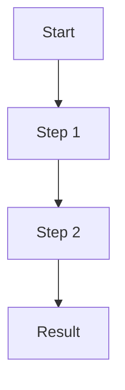

# Blog Writer

## Instructions

This skill helps you craft high-quality blog posts for the Neural Notes section of davideasaf.com from unstructured ideas, notes, or outlines. The content should target technology professionals and generative AI enthusiasts.

### Inputs

When the user provides unstructured details about a blog post idea, gather the following information (ask if not provided):

- **Topic/Idea**: The core concept or message
- **Key Points**: Main ideas, insights, or arguments to cover
- **Target Audience**: Specific audience segment (defaults to tech/AI professionals)
- **Tone**: Technical depth and style (defaults to practical, informative)
- **Length**: Short (800-1200 words), Medium (1200-2000 words), or Long (2000+ words)
- **Tags**: Relevant categories (e.g., "AI", "DevOps", "Best Practices")

### Content Guidelines

#### Voice & Style
- **Practical and actionable**: Focus on real-world applications and concrete examples
- **Technically accurate**: Use precise terminology, but explain complex concepts
- **Engaging**: Use clear structure, compelling headers, and conversational tone
- **Opinionated when appropriate**: Take positions backed by reasoning
- **Examples-driven**: Include code snippets, diagrams (Mermaid), or real scenarios

#### Structure Pattern
1. **Hook**: Start with a compelling opening that establishes why this matters
2. **Context**: Brief background or problem statement
3. **Main Content**: 3-5 major sections with clear headers
4. **Practical Examples**: Code, diagrams, or step-by-step guidance
5. **Key Takeaways**: Summarize main points
6. **Call to Action**: Encourage engagement (optional)

#### Technical Elements
- Use Mermaid diagrams for workflows, architectures, or processes
- Include code blocks with proper language syntax highlighting
- Add editor notes in blockquotes for missing elements (e.g., screenshots)
- Reference specific technologies, tools, or frameworks accurately

### MDX Frontmatter Format

Every blog post must start with YAML frontmatter:

```yaml
---
title: "Compelling Title: Clear Value Proposition"
excerpt: "One-sentence hook that makes readers want to learn more"
date: "YYYY-MM-DD"
author: "David Asaf"
tags:
  - "Tag1"
  - "Tag2"
  - "Tag3"
featured: false
hasVideo: false
hasAudio: false
draft: true
editorTodos:
  - "Add screenshots for X"
  - "Insert real links for Y"
  - "Verify code examples run correctly"
---
```

**Field Notes:**
- `title`: 50-70 characters, descriptive and compelling
- `excerpt`: 120-160 characters, SEO-friendly summary
- `date`: Use today's date in ISO format (YYYY-MM-DD)
- `tags`: 3-5 relevant categories from the tech/AI domain
- `draft: true`: Always start as draft for editor review
- `editorTodos`: List tasks for the editor skill to review

### Content Output

Generate a complete MDX file with:

1. **Frontmatter** with all required fields
2. **Main heading** (# title matching frontmatter)
3. **Opening paragraph** that hooks the reader
4. **Well-structured sections** with H2 (##) and H3 (###) headers
5. **Code examples** or diagrams where appropriate
6. **Conclusion or takeaways**
7. **Editor notes** as blockquotes where manual work is needed

### Example Structure

```mdx
---
title: "Your Compelling Title Here"
excerpt: "A hook that summarizes the value in one sentence"
date: "2025-10-19"
author: "David Asaf"
tags:
  - "AI"
  - "Development"
  - "Best Practices"
featured: false
hasVideo: false
hasAudio: false
draft: true
editorTodos:
  - "Add screenshot of X"
  - "Verify links to tool Y"
---

# Your Compelling Title Here

Opening paragraph that establishes the problem, opportunity, or insight. Make it clear why this matters to the reader.

## Context or Background

Brief setup that gives necessary context without overloading the reader.

---

## Main Section 1: Key Concept

Dive into the first major idea with concrete examples.

```javascript
// Example code if relevant
const example = "shows real usage";
```

---

## Main Section 2: Practical Application

Show how this works in practice.



---

## Main Section 3: Gotchas or Advanced Topics

Address common issues or deeper insights.

> Editor note: Add screenshot showing the actual UI here

---

## Key Takeaways

- Bullet 1: Main insight
- Bullet 2: Actionable advice
- Bullet 3: What to do next

---

## Call to Action (optional)

Encourage readers to try this, share feedback, or explore further.
```

### Workflow Steps

1. **Gather inputs**: Ensure you have the topic, key points, and any specific requirements
2. **Research context**: If needed, verify technical accuracy of concepts
3. **Draft frontmatter**: Create complete YAML frontmatter with appropriate metadata
4. **Write content**: Follow the structure pattern with clear sections
5. **Add examples**: Include code, diagrams, or concrete scenarios
6. **Add editor notes**: Flag items that need manual review (screenshots, links, verification)
7. **Save file**: Write to `content/neural-notes/[slug].mdx` where slug is kebab-case title

### File Naming Convention

Convert the title to kebab-case for the filename:
- Title: "Ship Your Portfolio with Agentic Tools"
- Filename: `ship-your-portfolio-with-agentic-tools.mdx`

### Best Practices

1. **Start with structure**: Outline headers before writing content
2. **Use active voice**: Keep sentences direct and clear
3. **Break up long sections**: Use subheadings (###) for readability
4. **Add visual breaks**: Use horizontal rules (---) between major sections
5. **Include code carefully**: Test examples or add editor notes to verify
6. **Reference real tools**: Use actual product names and link appropriately
7. **Mind the audience**: Technical but accessible to intermediate developers
8. **Flag uncertainties**: Add editor notes for anything that needs verification

## Examples

### Example 1: Quick Technical Post

**User Input:** "Write a post about how we use Playwright for E2E testing in our portfolio site"

**Assistant Actions:**
1. Asks clarifying questions about key insights or specific examples
2. Creates frontmatter with relevant tags ("Testing", "Playwright", "E2E")
3. Structures content around:
   - Why E2E testing matters for portfolios
   - How Playwright is set up
   - Example test cases
   - CI/CD integration
   - Tips and gotchas
4. Includes code snippets from actual test files
5. Adds editor notes for screenshots of test results
6. Saves to `content/neural-notes/playwright-e2e-testing-portfolio.mdx`

### Example 2: Long-form AI Workflow Post

**User Input:** "I want to write about the complete workflow for building features with AI agents - from ideation to deployment. Cover tools like Cursor, Claude, and how to structure prompts."

**Assistant Actions:**
1. Gathers specifics on workflow steps and tools
2. Creates comprehensive frontmatter with AI/DevOps tags
3. Structures as a multi-section guide:
   - The problem with traditional workflows
   - Step-by-step agentic workflow
   - Tool selection and configuration
   - Prompt engineering best practices
   - Real example with before/after
   - Common pitfalls
   - Future evolution
4. Includes Mermaid workflow diagram
5. Adds code examples of good vs. bad prompts
6. Flags editor todos for tool screenshots and links
7. Saves with appropriate slug name

### Example 3: Opinion Piece

**User Input:** "Quick post: why most AI coding tools focus on the wrong metrics. They optimize for speed but ignore context quality."

**Assistant Actions:**
1. Confirms tone and target length (short, opinionated)
2. Creates punchy frontmatter and excerpt
3. Structures as argument-driven piece:
   - The current state of AI tools
   - What metrics they optimize for
   - Why this misses the point
   - What better metrics would be
   - Call to tool makers
4. Uses concrete examples of tools and their tradeoffs
5. Keeps it focused and concise (800-1000 words)
6. Saves as draft for editor review

## Post-Generation Checklist

After generating content, confirm:
- [ ] Frontmatter is complete and valid YAML
- [ ] Title and excerpt are compelling
- [ ] Tags are relevant and specific
- [ ] Content follows logical structure
- [ ] Code examples have syntax highlighting
- [ ] Mermaid diagrams are properly formatted
- [ ] Editor todos are clearly listed
- [ ] File saved to correct location
- [ ] Filename uses kebab-case

## Success Criteria

A successful blog post:
- Engages the target audience from the first paragraph
- Delivers practical, actionable insights
- Uses clear, scannable structure with good headers
- Includes concrete examples (code, diagrams, scenarios)
- Has complete metadata for proper site integration
- Flags any items needing manual editor review
- Is ready for the Editor skill to validate and improve
