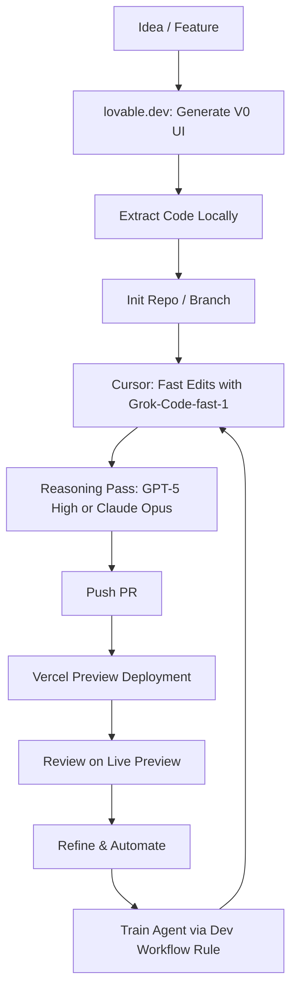

# Ship Your Portfolio with Agentic Tools: A Practical Starter

If you’ve been waiting for the “right” project to try agentic development, this is it. Your portfolio site is the perfect sandbox to learn fast, ship safely, and build a repeatable workflow you can use everywhere else.

This guide is a concrete, opinionated path:

- Start with a V0 UI from **lovable.dev**, then extract the code locally
- Iterate quickly in Cursor with a fast model like **Grok-Code-fast-1** (formerly Sonic)
- Use a higher-reasoning model (e.g., **GPT‑5 High**, **Claude Opus**) for planning/design
- Wire **CI/CD to Vercel** so every change gets a live Preview URL via PR
- Add a lightweight **dev workflow rule** that “trains” your agent to work the way you do

---

## The End-to-End Flow (at a glance)



> Editor note: If Mermaid isn’t enabled in MDX, export this diagram to PNG/SVG and set `banner` in frontmatter.

---

## Why start with your portfolio?

Low blast radius, high learning value. You’ll touch UI generation, local dev, model selection, CI/CD, and agent training—end-to-end in a few hours.

---

## Step 1 — Generate a V0 with lovable.dev

1. Open lovable.dev and either pick a template or prompt a design you like.  
2. Tweak the layout until it feels right. Prioritize a clean hero, projects grid, and about section.  
3. Use the platform’s “Export/Download code” option to get the starter code.  

[Editor: add real link to lovable.dev and a screenshot of the export flow]

Outcome: a working UI baseline you control locally.

---

## Step 2 — Extract locally and run

- Initialize a new repo (or a branch in your current site).  
- Install deps and run the dev server. Verify that the exported UI renders correctly.  

[Editor: insert exact commands for the chosen stack—e.g., Next.js, Vite, Astro]

---

## Step 3 — Wire CI/CD to Vercel with Preview URLs

You want “ask → PR → live preview” in minutes.

- Connect the GitHub repo to Vercel so each PR gets a Preview URL automatically.  
- Or add a minimal GitHub Action using the Vercel CLI:

```yaml
name: Vercel Preview
on: pull_request
jobs:
  deploy-preview:
    runs-on: ubuntu-latest
    steps:
      - uses: actions/checkout@v4
      - run: npm i -g vercel@latest
      - run: vercel pull --yes --environment=preview --token=${{ secrets.VERCEL_TOKEN }}
      - run: vercel build --token=${{ secrets.VERCEL_TOKEN }}
      - id: deploy
        run: |
          url=$(vercel deploy --prebuilt --token=${{ secrets.VERCEL_TOKEN }})
          echo "preview_url=$url" >> $GITHUB_OUTPUT
      - run: echo "Preview: ${{ steps.deploy.outputs.preview_url }}"
```

[Editor: remind readers to add `VERCEL_TOKEN` secret; optionally set `VERCEL_ORG_ID` and `VERCEL_PROJECT_ID`]

---

## Step 4 — Iterate in Cursor: fast vs. reasoning models

- Default to a fast inference provider for code changes: **Grok-Code-fast-1**.  
- Switch to a higher-reasoning model for planning/architecture: **GPT‑5 High** or **Claude Opus**.  
- Pattern to emulate:
  - Quick edits: fast model in small loops (diff → run → diff)  
  - Design/plan: reasoning model to propose options and tradeoffs  
  - Occasional “reasoning pass” to refactor or align direction  

[Editor: add a screenshot of Cursor’s model selector with fast + reasoning models visible]

---

## Step 5 — Ask the agent to ship via PR

Once CI is set, you can literally ask: “Create a branch, implement X, open a PR.”  
Because Vercel previews every PR, you review changes on a live URL.

[Optional] If you use GitHub CLI, your agent can run a small script to draft PRs consistently.  
[Editor: include a short snippet or link to your preferred script]

---

## Step 6 — Train your agent with a dev workflow rule

Put a single source of truth for your expectations in a markdown rule. I use a lightweight file that covers:

- Model disclosure (which model/config ran)  
- Task framing, constraints, and acceptance criteria  
- PR rubric (security, accessibility, performance, UX checks)  
- Labeling/checklist conventions and commit style  

Then, reference that rule when you ask for work. Over time, refine it as your agent (and team) learns.

[Editor: link to `docs/DEV-WORKFLOW-AGENT.md` in this repo and include a short excerpt]

---

## A simple starting checklist

- Create a lovable.dev V0 and export code  
- Run locally and commit to a new branch  
- Connect repo to Vercel so PRs auto-deploy  
- In Cursor, use Grok fast for edits; use a reasoning model for plans  
- Add a dev workflow rule markdown and reuse it on every task  

---

## Call to action

Don’t wait for the “big” project. Start with your portfolio this week.  
Generate the UI, wire the preview, and let your agent ship small changes daily. You’ll build the muscle memory—and the workflow—you can take to everything else.

> Editor note: Add a closing CTA: “Fork the starter,” “Open a PR template,” or “Subscribe for the full workflow file + examples.”


