# Managing Money - Claude Skills Edition

Over the past 72 hours, I've experienced a paradigm shift in how I think about AI-powered automation. Claude Skills has fundamentally changed my financial management workflow, and I believe it represents the future direction of agentic AI development.

## How It Works: The Skill Workflow

```mermaid
%%{init: {'theme':'base', 'themeVariables': { 'primaryColor':'#FF6B35', 'primaryTextColor':'#fff', 'primaryBorderColor':'#E55A2B', 'lineColor':'#FF6B35', 'secondaryColor':'#FFF5F2', 'tertiaryColor':'#FFE5DD', 'background':'#ffffff', 'mainBkg':'#FF6B35', 'secondaryBkg':'#FFF5F2', 'tertiaryBkg':'#FFE5DD', 'nodeBorder':'#E55A2B', 'clusterBkg':'#FFF5F2', 'clusterBorder':'#FF6B35', 'titleColor':'#2C3E50', 'edgeLabelBackground':'#ffffff', 'fontFamily':'system-ui'}}}%%
flowchart TD
    Start([📸 Upload Receipt]) --> Parse[Parse Receipt Items]

    Parse --> Context{Need Context?}

    Context -->|Categories| LoadCat[📥 Load Category Mappings]
    Context -->|Transaction| LoadTx[📥 Load Transaction Data]
    Context -->|Budget Rules| LoadBudget[📥 Load Budget Rules]

    LoadCat --> Categorize[🏷️ Categorize Each Item]
    LoadTx --> Categorize
    LoadBudget --> Categorize

    Categorize --> Split[✂️ Split Transaction]
    Split --> Notes[📝 Add Itemized Notes]
    Notes --> Update[💾 Update Monarch Money]

    Update --> Done([✅ Done])

    style Start fill:#FF6B35,stroke:#E55A2B,stroke-width:3px,color:#fff
    style Done fill:#FF6B35,stroke:#E55A2B,stroke-width:3px,color:#fff
    style Context fill:#FFE5DD,stroke:#FF6B35,stroke-width:2px,color:#2C3E50
    style LoadCat fill:#FFF5F2,stroke:#FF6B35,stroke-width:2px,color:#2C3E50
    style LoadTx fill:#FFF5F2,stroke:#FF6B35,stroke-width:2px,color:#2C3E50
    style LoadBudget fill:#FFF5F2,stroke:#FF6B35,stroke-width:2px,color:#2C3E50
    style Parse fill:#FFE5DD,stroke:#FF6B35,stroke-width:2px,color:#2C3E50
    style Categorize fill:#FFE5DD,stroke:#FF6B35,stroke-width:2px,color:#2C3E50
    style Split fill:#FFE5DD,stroke:#FF6B35,stroke-width:2px,color:#2C3E50
    style Notes fill:#FFE5DD,stroke:#FF6B35,stroke-width:2px,color:#2C3E50
    style Update fill:#FFE5DD,stroke:#FF6B35,stroke-width:2px,color:#2C3E50

    classDef contextLoad fill:#FFF5F2,stroke:#FF6B35,stroke-width:2px,color:#2C3E50
    class LoadCat,LoadTx,LoadBudget contextLoad
```

**Key insight**: Notice how context loads progressively - category mappings, transaction data, and budget rules only load when needed, not all at once. This is progressive context loading in action.

## The Challenge: Box Store Receipts

I use Monarch Money to manage my finances, and while it's an excellent platform, there's always room for workflow improvements. Monarch Money recently released a Chrome extension that automatically breaks down purchases from Amazon and Target - it's been incredibly beneficial. But what about Costco? Walmart? Sam's Club?

While waiting for official extensions, I decided to build my own solution using Claude Skills.

## The Monarch Money Integration

Monarch Money uses a GraphQL API, which makes integration surprisingly straightforward. You can observe the GraphQL queries and mutations in the web application's network tab, then adapt them into scripts that Claude can use within a skill.

Here's what I built: a skill that takes raw receipts from box stores like Walmart or Costco and:
- Categorizes items into my budget categories
- Splits transactions while retaining all original transaction details
- Adds helpful notes with itemized breakdowns
- Preserves the audit trail

Instead of a single "Walmart - $147.32" transaction, I now get properly categorized line items: groceries, household supplies, electronics - each in its proper budget category with full details.

## Why Skills Beat Heavy MCP Servers

This is where things get interesting from an architectural perspective.

For my Monarch Money integration, I chose to build small custom helper tools rather than importing a heavy MCP server with thousands of tokens of context. **This decision, combined with progressive context loading, has proven transformative.**

### The Context Problem

The AI industry has been engaged in a token arms race - 100K context windows, then 1M, now 2M tokens. On paper, these specs look impressive. In practice? Try this experiment:

1. Open a new Gemini chat (1M context window)
2. Tell it your favorite color at the start of the conversation
3. Have a long conversation
4. Ask it what your favorite color is

More often than not, it won't remember. Massive context windows don't automatically translate to effective memory.

## Progressive Context Loading: The Real Innovation

Claude Skills introduces something more valuable than massive context windows: **progressive context loading**.

This is the breakthrough that changes everything. Instead of dumping everything into context upfront, Skills intelligently load information only when it becomes relevant to the current task.

Think of it like working memory versus a filing cabinet. You don't need every file on your desk at once - you need the right file at the right moment. Progressive context loading delivers exactly that:

- **Load on demand**: Information arrives when needed, not before
- **Stay focused**: Context remains relevant to the current task
- **True memory**: Important details persist across interactions
- **Zero waste**: No tokens spent on irrelevant information

For my Monarch Money skill, this manifests beautifully:
- Transaction history loads only when analyzing patterns
- Category mappings load only when categorizing
- Budget rules load only when validating splits
- Receipt parsing utilities load only when processing receipts

The result? A skill that "remembers" my financial preferences and patterns better than a 2M token context window ever could. **Context efficiency matters more than context size.**

## The Custom Tools Advantage

Building lightweight custom tools within a skill - whether in TypeScript, Python, or any language with execution capability - provides several benefits:

**Precision**: Each tool does exactly what I need, nothing more
**Flexibility**: Use any language or runtime that fits your workflow
**Performance**: No bloat from unused MCP server capabilities
**Maintainability**: Simple, focused code that's easy to update
**Context efficiency**: Only the relevant tool context loads per task

Compare this to importing a full-featured financial MCP server that might include hundreds of functions I'll never use, each consuming precious context tokens.

The real power isn't the language choice - it's the ability to include custom code execution within your skill. As long as you provide the execution environment, Claude can leverage your tools effectively.

## The Future of Agentic AI

I believe Anthropic is onto something significant with Skills, and other AI providers will follow suit - just as they adopted the MCP protocol.

**The key insight**: Effective AI agents don't need infinite memory. They need smart memory.

Progressive context loading solves the real challenge in agentic AI: managing information relevance. It's not about how much the AI can theoretically hold in context, but about what it can effectively retrieve and apply at the right moment.

## The 72-Hour Impact

In just three days, Claude Skills has:
- Saved me hours of manual transaction categorization
- Improved my budget accuracy significantly
- Given me confidence in my box store spending breakdowns
- Provided a framework I can extend to other financial workflows

But more importantly, it's shown me a better way to build AI workflows - one that prioritizes intelligent context management over brute-force token capacity.

## My Recommendation

If you're building AI automation workflows, I highly recommend exploring Claude Skills:

1. **Start small**: Build focused, single-purpose skills
2. **Think progressive**: Embrace progressive context loading - information when needed, not upfront
3. **Keep it light**: Simple custom tools often beat heavy MCP servers
4. **Measure impact**: Context efficiency matters more than context size

The financial management use case is just one example. The principles apply to any domain where you need AI to "remember" preferences, patterns, and processes across multiple interactions.

## Conclusion

Claude Skills represents a maturation of the agentic AI space. We're moving beyond the "bigger is better" mentality of context windows toward smarter, more efficient context management.

For me, that means better financial management with less manual work. For the industry, it signals a shift toward AI systems that truly remember what matters - not because they can hold millions of tokens, but because they know what to remember and when to recall it.

That's the real game changer.

---

*Want to learn more about building Claude Skills? Check out the [official documentation](https://docs.anthropic.com/en/docs/build-with-claude/claude-skills) or explore my [Monarch Money skill on GitHub](https://github.com/yourusername/monarch-money-claude-skill).*
